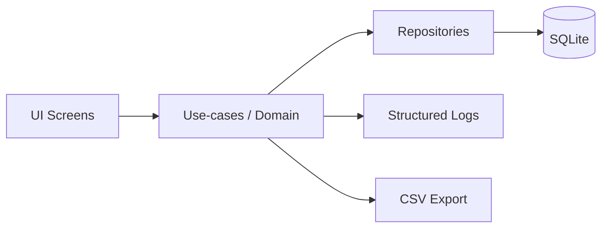
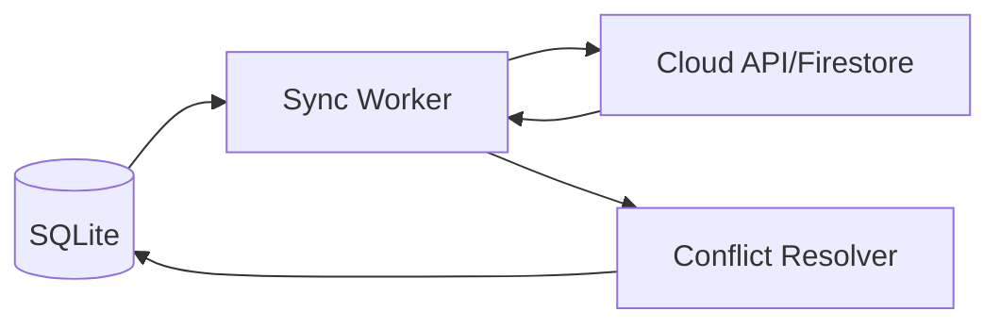
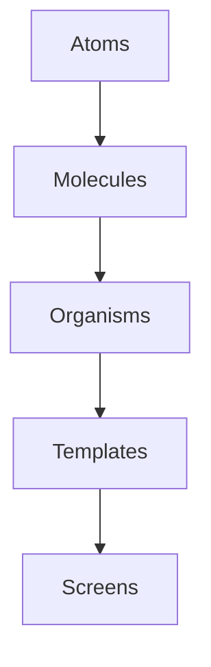

# React Native Expense Tracker — Modern Stack, UI System, Libraries & When-To-Use Guide (End-to-End)

**Last updated:** 2026-02-10  
**Purpose:** Help you initialize a React Native expense tracker with (1) **modern UI**, (2) **long-term maintainability**, (3) **offline-first MVP (SQLite)**, and (4) a **safe upgrade path** to cloud sync and advanced features (charts, reminders, receipts, exports).

---

## 0) Reality check (so you don’t sabotage yourself)

You’re asking for “modern and beautiful UI” plus “latest best practices” plus “end-to-end features” **before shipping MVP**. That’s how people stay in planning mode for months.

A UI library will not make your app beautiful. **A design system + component discipline + consistent UX behaviors** will. Your own weekly report already shows the pattern that actually works: building reusable components with Atomic Design improves consistency and long-term maintainability. fileciteturn1file0L5-L8

**Decision rule:** Pick a stack that reduces rewrites and lets you ship:

- **Expo** (fast iteration + EAS builds + less native pain)
- **SQLite + Drizzle** (offline-first, typed schema, migrations)
- **One UI system** (don’t mix three styling paradigms)
- **One navigation approach** (Expo Router _or_ React Navigation)
- **Charts** only for the 2–3 insights that matter (not dashboard theater)

---

## 1) Recommended baseline architecture

### MVP (Offline-first)

- Local DB: **SQLite**
- Domain: add/edit/delete expenses, categories, summary, CSV export
- Auth: Google Sign-In via Firebase (optional for MVP; you can ship guest-first)
- Charts: monthly trend + category split (2 screens max)
- Reminders: optional post-MVP

### Stable release (Hardening)

- Crash reporting + structured logs
- Regression test suite
- Performance fixes for large lists and summary queries
- Optional: budgets, recurring

### Cloud release (Sync)

- Sync metadata on every record
- Conflict rules defined before implementing sync
- Server: Firebase-first (fast) or API+Postgres (control)

---

## 2) Platform choice: Expo vs RN CLI (bare)

### Choose **Expo** unless you have a hard blocker

**Why:** you get faster setup, easier builds, and a smoother dependency story for a solo/small team.

Expo Router documentation describes file-based routing built for universal React Native apps (mobile + web). citeturn2search8

**When RN CLI is justified:**

- you need a native SDK that Expo can’t support (rare now)
- your team already has a mature native CI toolchain and wants full control

**Default recommendation:** Expo + EAS.

---

## 3) UI strategy (the big decision)

You need **one** of these approaches. Pick based on your team’s strengths.

### Option A — Material, highly production-proven: **React Native Paper**

- Best if you want “native-feeling” material components quickly.
- Strong component coverage and standard Material patterns. citeturn0search1turn0search11turn0search15
- Tradeoff: your app can look “generic material” unless you build a strong theme system and custom components.

**Use when**

- you want predictable components and don’t want to design everything from scratch
- you are okay with Material direction and want speed

**Avoid when**

- you want a very custom brand experience and your team hates Material conventions

### Option B — Design-system + performance optimizer: **Tamagui**

Tamagui provides a cross-platform style system and UI kit focused on typed styles and performance optimization. citeturn0search2turn0search4turn0search6turn0search16

**Use when**

- you want a scalable design system with tokens/themes
- you may share components across mobile + web later

**Avoid when**

- your team is inexperienced with design tokens and theming (you’ll misuse it and blame the library)

### Option C — Utility-first styling: **NativeWind**

NativeWind brings a Tailwind-like workflow to React Native; its docs note it works with Expo and RN projects, with Expo being streamlined. citeturn0search10turn0search14

**Use when**

- your team ships fast with Tailwind mental model
- you want consistent spacing/typography quickly

**Avoid when**

- you don’t enforce component boundaries (your UI becomes a soup of classes)
- you need very strict design system governance (tokens can still work, but you must enforce them)

### Option D — Pattern library with Tailwind-ish components: **gluestack-ui**

gluestack positions itself as a universal React/React Native component library and patterns system. citeturn0search0turn0search13

**Important risk note:** gluestack’s own blog documents a supply-chain incident affecting related packages in June 2025. citeturn0search3  
That doesn’t mean “never use it.” It means: **treat dependency security as real** (pin versions, audits, lockfiles, CI scans).

**Use when**

- you want a component system + patterns/templates and accept dependency-risk management as part of engineering

---

## 4) My pick for your expense tracker (pragmatic, long-term)

If you want “modern + beautiful” with the least regret:

- **Expo + Tamagui** (best for a strong design system)
- OR **Expo + NativeWind + a small headless component layer** (fastest iteration if you’re disciplined)

If you want the safest “it just works” UI:

- **Expo + React Native Paper**

**Do not** mix Paper + NativeWind + Tamagui in one app. That’s how you end up with inconsistent UI and slow refactors.

---

## 5) Navigation (routing)

### Best modern default: **Expo Router**

- File-based routing, built on top of React Navigation (under the hood). citeturn2search8turn2search4turn2search12  
  **Use when:** you want predictable routing structure, deep links, and universal patterns.

### Alternative: **React Navigation**

React Navigation announced an 8.0 alpha (Dec 19, 2025) and has active alpha releases as of Feb 2026. citeturn1search3turn1search7turn1search11  
**Use when:** you want direct control and prefer config-based navigation.

**Recommendation:** If you go Expo, pick **Expo Router**. If you go RN CLI, pick **React Navigation** stable channel.

---

## 6) State management (don’t over-engineer)

### Split state into:

- **Server state** (Phase 2 cloud): TanStack Query
- **Client/UI state**: Zustand (or Redux Toolkit if you have heavy workflows)

TanStack Query docs state it works out of the box with React Native. citeturn2search17

**MVP recommended**

- Zustand for app state (filters, selected month, UI toggles)
- No Redux unless you truly need it

---

## 7) Local persistence (SQLite) — best modern approach

### SQLite: **expo-sqlite**

- Use Expo’s SQLite stack and build your data layer properly.

### ORM + migrations: **Drizzle ORM + expo-sqlite**

Drizzle’s docs show a native driver for Expo SQLite and migration tooling. citeturn1search2turn1search6  
Expo also published guidance on “modern SQLite” for React Native apps (Drizzle-based workflow). citeturn1search10

**Use when**

- you want typed schema, predictable migrations, and fewer raw-SQL mistakes

**Avoid when**

- you think ORMs remove the need to understand indexes and query costs (they don’t)

### Key-value storage (fast settings/cache)

**react-native-mmkv** is widely used for fast key/value storage. citeturn2search10turn2search2  
Snyk notes a positive release cadence (signal of ongoing maintenance). citeturn2search18

Use MMKV for:

- theme preference
- auth flags
- small caches

Do **not** use MMKV for:

- large lists of expenses
- relational data

---

## 8) Auth (Firebase Google Sign-In)

**MVP guidance:** Ship guest-first, add Google sign-in quickly after.  
Your weekly report shows real-world pain of OTP reliability (Firebase OTP issues and switching providers). fileciteturn1file4L5-L7  
For an expense tracker, OTP is unnecessary complexity: **Google provider is enough** for most users.

Implementation options:

- Expo + Firebase Web SDK (simplest)
- RN CLI: react-native-firebase (common approach)

**Rule:** tokens in secure storage, never in SQLite.

---

## 9) Charts / graphs (visualization) — library choices + when to use

You want charts for:

- category split (pie/donut)
- spending trend (line)
- top categories (bar)

### Recommended chart libraries

- **victory-native-xl**: explicitly states active maintenance and performance focus. citeturn1search4turn1search8
- **react-native-gifted-charts**: broad set of chart types and a demo site. citeturn1search1turn1search13

A comparison roundup of RN chart libraries is available (useful for scanning options). citeturn1search0

**Recommendation for expense tracker**

- If you need smooth, “premium” charts: **victory-native-xl**
- If you want quick wins and many chart types: **react-native-gifted-charts**

**Avoid chart bloat**

- If charts don’t change user decisions, delete them. “More charts” is not “more value.”

---

## 10) Animations & micro-interactions (modern feel)

Your report highlights polishing micro-interactions improves UX. fileciteturn1file3L69-L70

Use:

- **react-native-reanimated** for performant animations. Its GitHub notes Reanimated 4.x supports only the New RN architecture and the latest RN versions. citeturn2search15  
  This is a strong signal: **adopt the New Architecture** if you want long-term support.

---

## 11) “Feature plugins” you’ll likely need (expense tracker specific)

### Core UX

- Date/time picker (platform-native where possible)
- Currency formatting (Intl, locale aware)
- Search + filters (debounced)
- Swipe actions (edit/delete)

### Export

- CSV generation
- File system write
- Share sheet

### Receipts (post-MVP)

- Camera / image picker
- Local storage with cleanup policy
- Optional cloud object storage later

### Reminders (post-MVP)

- Local notifications
- Background task scheduler (careful with OS limits)

### Notifications

Your report shows building notification systems requires end-to-end triggers and click-path routing (not “just add FCM”). fileciteturn1file1L1-L7

---

## 12) Observability (logs, crashes, diagnostics)

Your report shows the impact of adding structured logging and improving secret management for maintainability. fileciteturn1file3L18-L21

MVP minimum:

- Crash reporting
- Structured logs for “expense_saved”, “export_done”, “db_migration”

Rules:

- no PII in logs
- redact sensitive notes/merchant names if you log events

---

## 13) Dependency & supply-chain security (don’t ignore this)

If you pick any UI ecosystem with many packages (especially pattern libraries), lock it down.
The gluestack incident report is a reminder that JS supply-chain attacks are real. citeturn0search3

Minimum controls:

- pin versions (no wildcards)
- lockfile committed
- CI: npm audit / pnpm audit + secret scanning
- Dependabot/renovate PRs + review gate

---

## 14) Suggested “modern stack” package map (what/where/when)

### Foundation

- Expo (EAS builds) — **always**
- TypeScript — **always**
- Expo Router — **navigation**
- React Navigation (only if you avoid Router)

### UI

Pick one:

- React Native Paper — Material UI kit citeturn0search1
- Tamagui — design system + performance tooling citeturn0search2
- NativeWind — utility-first styling citeturn0search10
- gluestack-ui — patterns + components (with strict dependency security) citeturn0search0turn0search3

### Data & storage

- expo-sqlite + Drizzle ORM (schema + migrations) citeturn1search2turn1search10
- MMKV for small key/value settings citeturn2search10turn2search18

### State

- Zustand for UI/client state (MVP)
- TanStack Query for server state (Phase 2+) citeturn2search17

### Charts

- victory-native-xl OR react-native-gifted-charts citeturn1search4turn1search1

### Animation

- Reanimated (prefer new architecture) citeturn2search15

### Auth

- Firebase Google provider (avoid OTP unless required) fileciteturn1file4L5-L7

---

## 15) Mermaid diagrams (copy into docs/wiki)

### 15.1 MVP data flow

### 15.2 Cloud-ready sync (Phase 2)

### 15.3 UI system discipline (Atomic Design inspired)

Atomic Design + reusable alerts/warning cards were explicitly used in your prior work to improve maintainability. fileciteturn1file0L5-L8

---

## 16) Initialization checklist (what to do first)

1. **Pick UI strategy** (Paper vs Tamagui vs NativeWind). Don’t delay this.
2. Create Expo project + TypeScript.
3. Add routing (Expo Router) and define your screen map:
   - Home, Add Expense, History, Insights, Settings
4. Add SQLite + Drizzle schema and migrations.
5. Implement expense CRUD + category system.
6. Add summary queries + first charts.
7. Add export CSV.
8. Add crash reporting + minimal logs.
9. Only then: sign-in and cloud roadmap.

---

## 17) What you should stop doing (common traps)

- Picking libraries to feel “modern” instead of to reduce maintenance.
- Building cloud sync before MVP stability.
- Adding OTP login because it “sounds professional” (it’s mostly pain and support tickets).
- Adding 10 charts instead of 2 that matter.

---

## Appendix: Sources referenced

- React Native Paper docs/repo citeturn0search1turn0search11turn0search15
- Tamagui docs citeturn0search2turn0search4turn0search6turn0search16
- NativeWind docs citeturn0search10turn0search14
- gluestack-ui overview + incident report citeturn0search0turn0search3turn0search13
- React Navigation 8 alpha announcements/releases citeturn1search3turn1search7turn1search11
- Drizzle + Expo SQLite docs + Expo blog citeturn1search2turn1search10turn1search6
- Charts: victory-native-xl + gifted-charts + roundup citeturn1search4turn1search1turn1search0
- Reanimated GitHub compatibility note citeturn2search15
- Your weekly report evidence for Atomic Design, notifications, logging improvements fileciteturn1file0L5-L8 fileciteturn1file1L1-L7 fileciteturn1file3L18-L21
