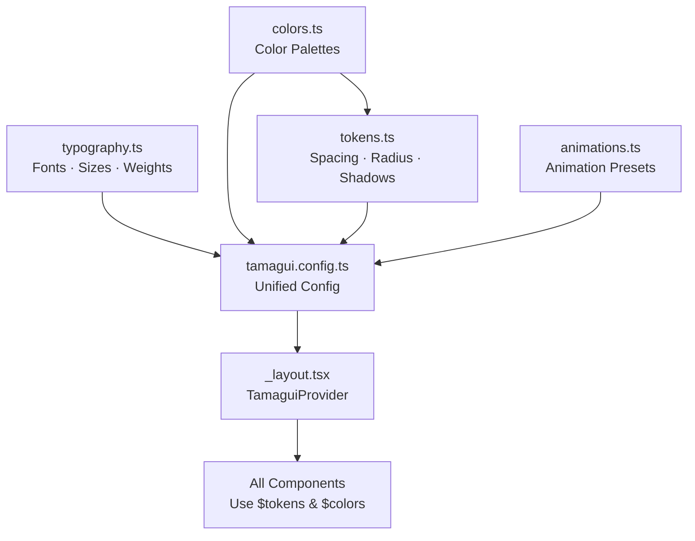

# Theme & Design System — Centralized Color + Token Configuration (Tamagui)

**Last updated:** 2026-02-11  
**Key principle:** Change colors/tokens in ONE place → entire app updates.

---

## 1) Architecture Overview



**★ Single source of truth:** All visual properties are defined in `src/theme/` files. Components NEVER hardcode colors, sizes, or spacing.

---

## 2) Color System — `src/theme/colors.ts`

```typescript
// src/theme/colors.ts
// ★ CHANGE COLORS HERE — affects entire app

export const palette = {
  // ─── Primary (Brand) ───
  primary50:  '#EEF2FF',
  primary100: '#E0E7FF',
  primary200: '#C7D2FE',
  primary300: '#A5B4FC',
  primary400: '#818CF8',
  primary500: '#6366F1',  // ★ Main brand color
  primary600: '#4F46E5',
  primary700: '#4338CA',
  primary800: '#3730A3',
  primary900: '#312E81',

  // ─── Success ───
  success50:  '#ECFDF5',
  success500: '#10B981',
  success700: '#047857',

  // ─── Warning ───
  warning50:  '#FFFBEB',
  warning500: '#F59E0B',
  warning700: '#B45309',

  // ─── Danger / Error ───
  danger50:  '#FEF2F2',
  danger500: '#EF4444',
  danger700: '#B91C1C',

  // ─── Neutral (Grays) ───
  gray50:  '#F9FAFB',
  gray100: '#F3F4F6',
  gray200: '#E5E7EB',
  gray300: '#D1D5DB',
  gray400: '#9CA3AF',
  gray500: '#6B7280',
  gray600: '#4B5563',
  gray700: '#374151',
  gray800: '#1F2937',
  gray900: '#111827',
  gray950: '#030712',

  // ─── Pure ───
  white: '#FFFFFF',
  black: '#000000',

  // ─── Category Colors (Expense Categories) ───
  categoryFood:       '#F97316',
  categoryTransport:  '#3B82F6',
  categoryShop:       '#EC4899',
  categoryBills:      '#8B5CF6',
  categoryHealth:     '#10B981',
  categoryEntertain:  '#F59E0B',
  categoryEducation:  '#06B6D4',
  categoryOther:      '#6B7280',
} as const;

// ─── Semantic Light Theme ───
export const lightTheme = {
  background:        palette.white,
  backgroundSoft:    palette.gray50,
  backgroundMuted:   palette.gray100,
  surface:           palette.white,
  surfaceHover:      palette.gray50,
  surfaceActive:     palette.gray100,

  textPrimary:       palette.gray900,
  textSecondary:     palette.gray600,
  textMuted:         palette.gray400,
  textInverse:       palette.white,

  border:            palette.gray200,
  borderFocused:     palette.primary500,
  borderError:       palette.danger500,

  primary:           palette.primary500,
  primaryHover:      palette.primary600,
  primaryMuted:      palette.primary100,

  success:           palette.success500,
  successMuted:      palette.success50,
  warning:           palette.warning500,
  warningMuted:      palette.warning50,
  danger:            palette.danger500,
  dangerMuted:       palette.danger50,

  tabBarBackground:  palette.white,
  tabBarBorder:      palette.gray200,
  tabBarActive:      palette.primary500,
  tabBarInactive:    palette.gray400,

  cardBackground:    palette.white,
  cardBorder:        palette.gray200,
  cardShadow:        'rgba(0, 0, 0, 0.05)',

  overlay:           'rgba(0, 0, 0, 0.4)',
  skeleton:          palette.gray200,
} as const;

// ─── Semantic Dark Theme ───
export const darkTheme = {
  background:        palette.gray950,
  backgroundSoft:    palette.gray900,
  backgroundMuted:   palette.gray800,
  surface:           palette.gray900,
  surfaceHover:      palette.gray800,
  surfaceActive:     palette.gray700,

  textPrimary:       palette.gray50,
  textSecondary:     palette.gray400,
  textMuted:         palette.gray600,
  textInverse:       palette.gray900,

  border:            palette.gray800,
  borderFocused:     palette.primary400,
  borderError:       palette.danger500,

  primary:           palette.primary400,
  primaryHover:      palette.primary500,
  primaryMuted:      palette.primary900,

  success:           palette.success500,
  successMuted:      '#064E3B',
  warning:           palette.warning500,
  warningMuted:      '#78350F',
  danger:            palette.danger500,
  dangerMuted:       '#7F1D1D',

  tabBarBackground:  palette.gray900,
  tabBarBorder:      palette.gray800,
  tabBarActive:      palette.primary400,
  tabBarInactive:    palette.gray600,

  cardBackground:    palette.gray900,
  cardBorder:        palette.gray800,
  cardShadow:        'rgba(0, 0, 0, 0.3)',

  overlay:           'rgba(0, 0, 0, 0.6)',
  skeleton:          palette.gray800,
} as const;

export type ThemeColors = typeof lightTheme;
```

---

## 3) Design Tokens — `src/theme/tokens.ts`

```typescript
// src/theme/tokens.ts
// ★ CHANGE SPACING / SIZING HERE — affects entire layout

export const tokens = {
  // ─── Spacing Scale (4px base) ───
  space: {
    0:    0,
    xs:   4,
    sm:   8,
    md:   12,
    lg:   16,
    xl:   20,
    '2xl': 24,
    '3xl': 32,
    '4xl': 40,
    '5xl': 48,
    '6xl': 64,
    '7xl': 80,
  },

  // ─── Sizing (Components) ───
  size: {
    0:    0,
    xs:   20,
    sm:   28,
    md:   36,
    lg:   44,   // Minimum touch target (accessibility)
    xl:   52,
    '2xl': 64,
    '3xl': 80,
    '4xl': 96,
    full: '100%',
  },

  // ─── Border Radius ───
  radius: {
    0:    0,
    xs:   4,
    sm:   8,
    md:   12,
    lg:   16,
    xl:   24,
    full: 9999,
  },

  // ─── Z-Index ───
  zIndex: {
    base:     0,
    dropdown: 10,
    sticky:   20,
    modal:    30,
    overlay:  40,
    toast:    50,
  },
} as const;

// ─── Shadows ───
export const shadows = {
  sm: {
    shadowColor: '#000',
    shadowOffset: { width: 0, height: 1 },
    shadowOpacity: 0.05,
    shadowRadius: 2,
    elevation: 1,
  },
  md: {
    shadowColor: '#000',
    shadowOffset: { width: 0, height: 2 },
    shadowOpacity: 0.1,
    shadowRadius: 4,
    elevation: 3,
  },
  lg: {
    shadowColor: '#000',
    shadowOffset: { width: 0, height: 4 },
    shadowOpacity: 0.15,
    shadowRadius: 8,
    elevation: 6,
  },
} as const;
```

---

## 4) Typography — `src/theme/typography.ts`

```typescript
// src/theme/typography.ts
// ★ CHANGE FONTS HERE — affects all text

export const typography = {
  // ─── Font Families (Inter via @tamagui/font-inter) ───
  family: {
    heading: 'Inter',
    body:    'Inter',
    mono:    'monospace',
  },

  // ─── Font Sizes ───
  size: {
    xs:   11,
    sm:   13,
    md:   15,
    lg:   17,
    xl:   20,
    '2xl': 24,
    '3xl': 30,
    '4xl': 36,
    '5xl': 48,
  },

  // ─── Line Heights ───
  lineHeight: {
    xs:   16,
    sm:   20,
    md:   22,
    lg:   26,
    xl:   28,
    '2xl': 32,
    '3xl': 38,
    '4xl': 44,
    '5xl': 56,
  },

  // ─── Font Weights ───
  weight: {
    regular:  '400',
    medium:   '500',
    semibold: '600',
    bold:     '700',
  },

  // ─── Letter Spacing ───
  letterSpacing: {
    tight:  -0.5,
    normal:  0,
    wide:    0.5,
    wider:   1.0,
  },
} as const;

// ─── Preset Text Styles ───
export const textStyles = {
  // Headlines
  h1: { fontSize: typography.size['4xl'], fontWeight: typography.weight.bold,     lineHeight: typography.lineHeight['4xl'] },
  h2: { fontSize: typography.size['3xl'], fontWeight: typography.weight.bold,     lineHeight: typography.lineHeight['3xl'] },
  h3: { fontSize: typography.size['2xl'], fontWeight: typography.weight.semibold, lineHeight: typography.lineHeight['2xl'] },
  h4: { fontSize: typography.size.xl,     fontWeight: typography.weight.semibold, lineHeight: typography.lineHeight.xl },

  // Body
  bodyLg:  { fontSize: typography.size.lg, fontWeight: typography.weight.regular, lineHeight: typography.lineHeight.lg },
  body:    { fontSize: typography.size.md, fontWeight: typography.weight.regular, lineHeight: typography.lineHeight.md },
  bodySm:  { fontSize: typography.size.sm, fontWeight: typography.weight.regular, lineHeight: typography.lineHeight.sm },

  // Labels / Captions
  label:   { fontSize: typography.size.sm, fontWeight: typography.weight.medium,  lineHeight: typography.lineHeight.sm },
  caption: { fontSize: typography.size.xs, fontWeight: typography.weight.regular, lineHeight: typography.lineHeight.xs },

  // Special
  amount:  { fontSize: typography.size['3xl'], fontWeight: typography.weight.bold, lineHeight: typography.lineHeight['3xl'], letterSpacing: typography.letterSpacing.tight },
  button:  { fontSize: typography.size.md,     fontWeight: typography.weight.semibold, lineHeight: typography.lineHeight.md },
} as const;
```

---

## 5) Animation Presets — `src/theme/animations.ts`

```typescript
// src/theme/animations.ts
import { createAnimations } from '@tamagui/animations-react-native';

export const animations = createAnimations({
  fast: {
    type: 'spring',
    damping: 20,
    mass: 1.2,
    stiffness: 250,
  },
  medium: {
    type: 'spring',
    damping: 15,
    mass: 0.9,
    stiffness: 150,
  },
  slow: {
    type: 'spring',
    damping: 20,
    mass: 0.9,
    stiffness: 100,
  },
  bouncy: {
    type: 'spring',
    damping: 9,
    mass: 0.9,
    stiffness: 150,
  },
  lazy: {
    type: 'spring',
    damping: 18,
    stiffness: 50,
  },
  tooltip: {
    damping: 10,
    mass: 0.9,
    stiffness: 100,
  },
});
```

---

## 6) Tamagui Config — `src/theme/tamagui.config.ts`

```typescript
// src/theme/tamagui.config.ts
import { createTamagui, createTokens } from 'tamagui';
import { createInterFont } from '@tamagui/font-inter';
import { shorthands } from '@tamagui/shorthands';

import { palette, lightTheme, darkTheme } from './colors';
import { tokens as appTokens } from './tokens';
import { typography } from './typography';
import { animations } from './animations';

// ─── Create Tamagui Tokens ───
const tamaguiTokens = createTokens({
  size:   appTokens.size,
  space:  appTokens.space,
  radius: appTokens.radius,
  zIndex: appTokens.zIndex,
  color:  palette,
});

// ─── Create Fonts ───
const interFont = createInterFont({
  size: typography.size,
  lineHeight: typography.lineHeight,
  weight: typography.weight,
  letterSpacing: typography.letterSpacing,
});

// ─── Build Themes (light + dark) ───
const themes = {
  light: lightTheme,
  dark:  darkTheme,
};

// ─── Export Config ───
export const config = createTamagui({
  tokens: tamaguiTokens,
  themes,
  fonts: {
    heading: interFont,
    body:    interFont,
  },
  shorthands,
  animations,
  defaultFont: 'body',
  shouldAddPrefersColorThemes: true,
  themeClassNameOnRoot: true,
});

export type AppConfig = typeof config;
```

---

## 7) Theme Provider Setup — `app/_layout.tsx`

```typescript
// app/_layout.tsx
import { useColorScheme } from 'react-native';
import { TamaguiProvider, Theme } from 'tamagui';
import { useFonts } from 'expo-font';
import { SplashScreen } from 'expo-router';

import config from '../tamagui.config';
import { useSettingsStore } from '@/store';

export default function RootLayout() {
  const systemScheme = useColorScheme();
  const themeMode = useSettingsStore((s) => s.themeMode); // 'system' | 'light' | 'dark'

  const resolvedTheme =
    themeMode === 'system' ? (systemScheme ?? 'light') : themeMode;

  const [fontsLoaded] = useFonts({
    Inter: require('../assets/fonts/Inter-Regular.ttf'),
    InterMedium: require('../assets/fonts/Inter-Medium.ttf'),
    InterSemiBold: require('../assets/fonts/Inter-SemiBold.ttf'),
    InterBold: require('../assets/fonts/Inter-Bold.ttf'),
  });

  if (!fontsLoaded) {
    return <SplashScreen />;
  }

  return (
    <TamaguiProvider config={config}>
      <Theme name={resolvedTheme}>
        {/* Expo Router slot */}
      </Theme>
    </TamaguiProvider>
  );
}
```

---

## 8) Using Tokens in Components

### ✅ Correct — Use theme tokens

```typescript
import { styled, YStack, Text } from 'tamagui';

const StyledCard = styled(YStack, {
  backgroundColor: '$cardBackground',
  borderColor: '$border',
  borderWidth: 1,
  borderRadius: '$md',
  padding: '$lg',
  gap: '$sm',
});

const Title = styled(Text, {
  color: '$textPrimary',
  fontSize: '$lg',
  fontWeight: '$semibold',
});
```

### ❌ Wrong — Never hardcode values

```typescript
// DON'T DO THIS
const BadCard = styled(YStack, {
  backgroundColor: '#FFFFFF',   // ❌ Hardcoded
  borderRadius: 12,             // ❌ Magic number
  padding: 16,                  // ❌ Not from tokens
});
```

---

## 9) Quick Reference: How to Change Things

| What to change | File to edit | What to modify |
|---|---|---|
| **Brand color** | `colors.ts` → `palette.primary*` | Change `primary500` and its shades |
| **Dark mode colors** | `colors.ts` → `darkTheme` | Modify semantic dark values |
| **Spacing scale** | `tokens.ts` → `space` | Edit spacing values |
| **Font family** | `typography.ts` → `family` | Change font name |
| **Font sizes** | `typography.ts` → `size` | Edit size scale |
| **Border radius** | `tokens.ts` → `radius` | Edit radius scale |
| **Category colors** | `colors.ts` → `palette.category*` | Add/change category colors |
| **Animation feel** | `animations.ts` | Adjust spring parameters |
| **Shadow depth** | `tokens.ts` → `shadows` | Edit shadow values |
| **Theme mode** | `useSettingsStore` | Toggle `'light'` / `'dark'` / `'system'` |
