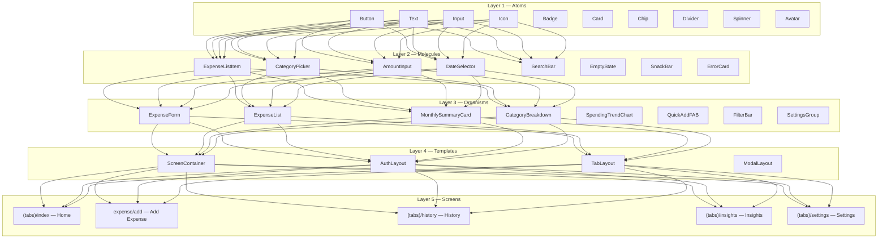

# Component Architecture — Atomic Design System Guide

**Last updated:** 2026-02-11  
**Pattern:** Atomic Design (Atoms → Molecules → Organisms → Templates → Screens)

---

## 1) Atomic Design Layers



---

## 2) Component Catalog — Atoms

### 2.1 Button

```typescript
// src/components/atoms/Button/Button.tsx
import React from 'react';
import { styled, GetProps, Spinner } from 'tamagui';
import { Text } from '../Text';

const StyledButton = styled(TamaguiButton, {
  name: 'Button',
  borderRadius: '$md',
  paddingHorizontal: '$lg',
  paddingVertical: '$md',
  alignItems: 'center',
  justifyContent: 'center',
  minHeight: '$lg', // 44px touch target

  variants: {
    variant: {
      primary: {
        backgroundColor: '$primary',
        pressStyle: { backgroundColor: '$primaryHover', scale: 0.98 },
      },
      secondary: {
        backgroundColor: 'transparent',
        borderWidth: 1,
        borderColor: '$border',
        pressStyle: { backgroundColor: '$surfaceHover' },
      },
      danger: {
        backgroundColor: '$danger',
        pressStyle: { backgroundColor: '$dangerMuted', scale: 0.98 },
      },
      ghost: {
        backgroundColor: 'transparent',
        pressStyle: { backgroundColor: '$surfaceHover' },
      },
    },
    size: {
      sm: { paddingHorizontal: '$md', paddingVertical: '$sm', minHeight: '$sm' },
      md: { paddingHorizontal: '$lg', paddingVertical: '$md', minHeight: '$lg' },
      lg: { paddingHorizontal: '$xl', paddingVertical: '$lg', minHeight: '$xl' },
    },
    fullWidth: {
      true: { width: '100%' },
    },
  } as const,

  defaultVariants: {
    variant: 'primary',
    size: 'md',
  },
});

type ButtonProps = GetProps<typeof StyledButton> & {
  isLoading?: boolean;
};

export const Button: React.FC<ButtonProps> = ({
  isLoading,
  children,
  disabled,
  ...props
}) => (
  <StyledButton
    disabled={disabled || isLoading}
    opacity={disabled ? 0.5 : 1}
    {...props}
  >
    {isLoading ? (
      <Spinner size="small" color="$textInverse" />
    ) : (
      <Text variant="button" color={props.variant === 'secondary' ? '$textPrimary' : '$textInverse'}>
        {children}
      </Text>
    )}
  </StyledButton>
);
```

### 2.2 Text

```typescript
// src/components/atoms/Text/Text.tsx
import { styled, Text as TamaguiText } from 'tamagui';

export const Text = styled(TamaguiText, {
  name: 'Text',
  color: '$textPrimary',
  fontFamily: '$body',

  variants: {
    variant: {
      h1:      { fontSize: '$4xl', fontWeight: '$bold',     lineHeight: '$4xl' },
      h2:      { fontSize: '$3xl', fontWeight: '$bold',     lineHeight: '$3xl' },
      h3:      { fontSize: '$2xl', fontWeight: '$semibold', lineHeight: '$2xl' },
      h4:      { fontSize: '$xl',  fontWeight: '$semibold', lineHeight: '$xl' },
      bodyLg:  { fontSize: '$lg',  fontWeight: '$regular',  lineHeight: '$lg' },
      body:    { fontSize: '$md',  fontWeight: '$regular',  lineHeight: '$md' },
      bodySm:  { fontSize: '$sm',  fontWeight: '$regular',  lineHeight: '$sm' },
      label:   { fontSize: '$sm',  fontWeight: '$medium',   lineHeight: '$sm' },
      caption: { fontSize: '$xs',  fontWeight: '$regular',  lineHeight: '$xs', color: '$textSecondary' },
      amount:  { fontSize: '$3xl', fontWeight: '$bold',     lineHeight: '$3xl', letterSpacing: -0.5 },
      button:  { fontSize: '$md',  fontWeight: '$semibold', lineHeight: '$md' },
    },
  } as const,

  defaultVariants: {
    variant: 'body',
  },
});
```

### 2.3 Card

```typescript
// src/components/atoms/Card/Card.tsx
import { styled, YStack } from 'tamagui';

export const Card = styled(YStack, {
  name: 'Card',
  backgroundColor: '$cardBackground',
  borderRadius: '$lg',
  borderWidth: 1,
  borderColor: '$cardBorder',
  padding: '$lg',
  gap: '$sm',

  variants: {
    elevated: {
      true: {
        shadowColor: '$cardShadow',
        shadowOffset: { width: 0, height: 2 },
        shadowOpacity: 1,
        shadowRadius: 8,
        elevation: 3,
      },
    },
    pressable: {
      true: {
        pressStyle: {
          scale: 0.98,
          backgroundColor: '$surfaceHover',
        },
      },
    },
  } as const,
});
```

### 2.4 Input

```typescript
// src/components/atoms/Input/Input.tsx
import React from 'react';
import { styled, Input as TamaguiInput, GetProps, YStack } from 'tamagui';
import { Text } from '../Text';

const StyledInput = styled(TamaguiInput, {
  name: 'Input',
  backgroundColor: '$surface',
  borderColor: '$border',
  borderWidth: 1,
  borderRadius: '$md',
  paddingHorizontal: '$lg',
  paddingVertical: '$md',
  color: '$textPrimary',
  placeholderTextColor: '$textMuted',
  fontSize: '$md',
  minHeight: '$lg',

  focusStyle: {
    borderColor: '$borderFocused',
    borderWidth: 2,
  },

  variants: {
    error: {
      true: {
        borderColor: '$borderError',
        focusStyle: { borderColor: '$borderError' },
      },
    },
  } as const,
});

type InputProps = GetProps<typeof StyledInput> & {
  label?: string;
  errorMessage?: string;
};

export const Input: React.FC<InputProps> = ({
  label,
  errorMessage,
  error,
  ...props
}) => (
  <YStack gap="$xs">
    {label && <Text variant="label">{label}</Text>}
    <StyledInput error={!!errorMessage || error} {...props} />
    {errorMessage && (
      <Text variant="caption" color="$danger">{errorMessage}</Text>
    )}
  </YStack>
);
```

---

## 3) Component Catalog — Molecules

### 3.1 ExpenseListItem

```typescript
// src/components/molecules/ExpenseListItem/ExpenseListItem.tsx
import React from 'react';
import { XStack, YStack } from 'tamagui';
import { Text, Icon, Card } from '@/components/atoms';
import { formatCurrency, formatRelativeDate } from '@/lib/format';
import { Expense } from '@/types';

interface ExpenseListItemProps {
  expense: Expense;
  onPress: (id: string) => void;
  onDelete?: (id: string) => void;
}

export const ExpenseListItem: React.FC<ExpenseListItemProps> = ({
  expense,
  onPress,
}) => (
  <Card pressable onPress={() => onPress(expense.id)}>
    <XStack alignItems="center" gap="$md">
      <Icon
        name={expense.categoryIcon}
        size={24}
        color={expense.categoryColor}
      />
      <YStack flex={1}>
        <Text variant="label">{expense.categoryName}</Text>
        {expense.note && (
          <Text variant="caption" numberOfLines={1}>{expense.note}</Text>
        )}
      </YStack>
      <YStack alignItems="flex-end">
        <Text variant="label" color="$danger">
          -{formatCurrency(expense.amountMinor, expense.currency)}
        </Text>
        <Text variant="caption">
          {formatRelativeDate(expense.occurredAt)}
        </Text>
      </YStack>
    </XStack>
  </Card>
);
```

### 3.2 AmountInput

```typescript
// src/components/molecules/AmountInput/AmountInput.tsx
import React, { useState } from 'react';
import { YStack, XStack } from 'tamagui';
import { Text, Input } from '@/components/atoms';

interface AmountInputProps {
  value: string;
  currencySymbol: string;
  onChangeAmount: (val: string) => void;
  error?: string;
}

export const AmountInput: React.FC<AmountInputProps> = ({
  value,
  currencySymbol,
  onChangeAmount,
  error,
}) => (
  <YStack gap="$xs">
    <Text variant="label">Amount</Text>
    <XStack alignItems="center" gap="$sm">
      <Text variant="h3" color="$textSecondary">{currencySymbol}</Text>
      <Input
        flex={1}
        value={value}
        onChangeText={onChangeAmount}
        keyboardType="decimal-pad"
        placeholder="0.00"
        errorMessage={error}
        fontSize="$3xl"
        fontWeight="$bold"
      />
    </XStack>
  </YStack>
);
```

### 3.3 EmptyState

```typescript
// src/components/molecules/EmptyState/EmptyState.tsx
import React from 'react';
import { YStack } from 'tamagui';
import { Text, Icon, Button } from '@/components/atoms';

interface EmptyStateProps {
  icon: string;
  title: string;
  description: string;
  actionLabel?: string;
  onAction?: () => void;
}

export const EmptyState: React.FC<EmptyStateProps> = ({
  icon,
  title,
  description,
  actionLabel,
  onAction,
}) => (
  <YStack flex={1} alignItems="center" justifyContent="center" padding="$3xl" gap="$lg">
    <Icon name={icon} size={64} color="$textMuted" />
    <Text variant="h4" textAlign="center">{title}</Text>
    <Text variant="body" color="$textSecondary" textAlign="center">{description}</Text>
    {actionLabel && onAction && (
      <Button variant="primary" onPress={onAction}>{actionLabel}</Button>
    )}
  </YStack>
);
```

---

## 4) Component Catalog — Organisms

### 4.1 ExpenseForm

```typescript
// src/components/organisms/ExpenseForm/ExpenseForm.tsx
import React from 'react';
import { YStack } from 'tamagui';
import { AmountInput, CategoryPicker, DateSelector } from '@/components/molecules';
import { Input, Button } from '@/components/atoms';
import { useExpenseForm } from '@/hooks';

interface ExpenseFormProps {
  expenseId?: string; // undefined = create, string = edit
  onSuccess: () => void;
}

export const ExpenseForm: React.FC<ExpenseFormProps> = ({
  expenseId,
  onSuccess,
}) => {
  const {
    amount, setAmount,
    categoryId, setCategoryId,
    date, setDate,
    note, setNote,
    merchant, setMerchant,
    errors,
    isSubmitting,
    handleSubmit,
  } = useExpenseForm({ expenseId, onSuccess });

  return (
    <YStack gap="$lg" padding="$lg">
      <AmountInput
        value={amount}
        currencySymbol="$"
        onChangeAmount={setAmount}
        error={errors.amount}
      />

      <CategoryPicker
        selectedId={categoryId}
        onSelect={setCategoryId}
        error={errors.categoryId}
      />

      <DateSelector
        value={date}
        onChange={setDate}
      />

      <Input
        label="Merchant (optional)"
        value={merchant}
        onChangeText={setMerchant}
        placeholder="e.g. Starbucks"
      />

      <Input
        label="Note (optional)"
        value={note}
        onChangeText={setNote}
        placeholder="What was this for?"
        multiline
        numberOfLines={3}
      />

      <Button
        variant="primary"
        fullWidth
        isLoading={isSubmitting}
        onPress={handleSubmit}
      >
        {expenseId ? 'Update Expense' : 'Add Expense'}
      </Button>
    </YStack>
  );
};
```

### 4.2 MonthlySummaryCard

```typescript
// src/components/organisms/MonthlySummaryCard/MonthlySummaryCard.tsx
import React from 'react';
import { XStack, YStack } from 'tamagui';
import { Card, Text, Badge } from '@/components/atoms';
import { formatCurrency } from '@/lib/format';

interface MonthlySummaryCardProps {
  totalSpent: number;
  currency: string;
  transactionCount: number;
  percentChange?: number; // vs previous month
}

export const MonthlySummaryCard: React.FC<MonthlySummaryCardProps> = ({
  totalSpent,
  currency,
  transactionCount,
  percentChange,
}) => (
  <Card elevated padding="$xl">
    <Text variant="caption" color="$textSecondary">This Month</Text>
    <XStack alignItems="baseline" gap="$sm">
      <Text variant="amount" color="$textPrimary">
        {formatCurrency(totalSpent, currency)}
      </Text>
      {percentChange !== undefined && (
        <Badge
          variant={percentChange > 0 ? 'danger' : 'success'}
          label={`${percentChange > 0 ? '+' : ''}${percentChange}%`}
        />
      )}
    </XStack>
    <Text variant="bodySm" color="$textSecondary">
      {transactionCount} transaction{transactionCount !== 1 ? 's' : ''}
    </Text>
  </Card>
);
```

---

## 5) Component Catalog — Templates

### 5.1 ScreenContainer

```typescript
// src/components/templates/ScreenContainer/ScreenContainer.tsx
import React from 'react';
import { YStack, ScrollView } from 'tamagui';
import { useSafeAreaInsets } from 'react-native-safe-area-context';

interface ScreenContainerProps {
  children: React.ReactNode;
  scrollable?: boolean;
  padded?: boolean;
}

export const ScreenContainer: React.FC<ScreenContainerProps> = ({
  children,
  scrollable = false,
  padded = true,
}) => {
  const insets = useSafeAreaInsets();

  const content = (
    <YStack
      flex={1}
      backgroundColor="$background"
      paddingTop={insets.top}
      paddingBottom={insets.bottom}
      paddingHorizontal={padded ? '$lg' : 0}
    >
      {children}
    </YStack>
  );

  if (scrollable) {
    return (
      <ScrollView
        flex={1}
        backgroundColor="$background"
        contentContainerStyle={{ paddingBottom: insets.bottom + 20 }}
        showsVerticalScrollIndicator={false}
      >
        {content}
      </ScrollView>
    );
  }

  return content;
};
```

---

## 6) Component States (Every Component Must Handle)

| State | Description | Implementation |
|---|---|---|
| **Default** | Normal display | Base render |
| **Loading** | Fetching data | `<Spinner>` or skeleton |
| **Empty** | No data available | `<EmptyState>` molecule |
| **Error** | Something failed | `<ErrorCard>` with retry |
| **Disabled** | Not interactive | `opacity: 0.5`, no press |
| **Focused** | Active input | Border color change |

---

## 7) Component Rules

1. **Atoms** — No business logic, no hooks, no API calls. Pure visual.
2. **Molecules** — Can compose atoms. May use simple local state. No API calls.
3. **Organisms** — Can use hooks, call use-cases, manage form state. This is where logic lives.
4. **Templates** — Layout wrappers only. No business logic.
5. **Screens** — Compose organisms + templates. Absolutely minimal logic (just navigation params).
