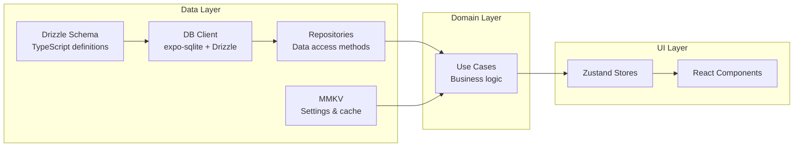

# Database Schema — Drizzle ORM + expo-sqlite (Typed, Migration-Ready)

**Last updated:** 2026-02-11  
**ORM:** Drizzle ORM | **DB:** expo-sqlite | **Storage:** MMKV (key-value)

---

## 1) Architecture Overview



---

## 2) Schema Definitions

### 2.1 Categories Table — `src/db/schema/categories.ts`

```typescript
// src/db/schema/categories.ts
import { sqliteTable, text, integer } from 'drizzle-orm/sqlite-core';

export const categories = sqliteTable('categories', {
  id:          text('id').primaryKey(),                          // UUID
  name:        text('name').notNull(),
  icon:        text('icon'),                                     // icon identifier
  colorToken:  text('color_token'),                              // maps to palette.category*
  sortOrder:   integer('sort_order').notNull().default(0),
  isArchived:  integer('is_archived', { mode: 'boolean' }).notNull().default(false),
  createdAt:   integer('created_at', { mode: 'timestamp_ms' }).notNull(),
  updatedAt:   integer('updated_at', { mode: 'timestamp_ms' }).notNull(),
  deletedAt:   integer('deleted_at', { mode: 'timestamp_ms' }),  // soft delete

  // Phase 2: Sync metadata
  // clientId:       text('client_id'),
  // version:        integer('version').default(1),
  // syncState:      text('sync_state').default('LOCAL_ONLY'),
  // serverUpdatedAt: integer('server_updated_at', { mode: 'timestamp_ms' }),
});

export type Category = typeof categories.$inferSelect;
export type NewCategory = typeof categories.$inferInsert;
```

### 2.2 Expenses Table — `src/db/schema/expenses.ts`

```typescript
// src/db/schema/expenses.ts
import { sqliteTable, text, integer, index } from 'drizzle-orm/sqlite-core';
import { categories } from './categories';

export const expenses = sqliteTable('expenses', {
  id:             text('id').primaryKey(),                            // UUID
  amountMinor:    integer('amount_minor').notNull(),                  // cents (avoids float bugs)
  currency:       text('currency').notNull().default('USD'),          // ISO 4217
  categoryId:     text('category_id').notNull()
                    .references(() => categories.id),                 // FK
  occurredAt:     integer('occurred_at', { mode: 'timestamp_ms' }).notNull(), // user-selected date
  note:           text('note'),
  merchant:       text('merchant'),
  paymentMethod:  text('payment_method'),                            // cash | card | upi | other
  createdAt:      integer('created_at', { mode: 'timestamp_ms' }).notNull(),
  updatedAt:      integer('updated_at', { mode: 'timestamp_ms' }).notNull(),
  deletedAt:      integer('deleted_at', { mode: 'timestamp_ms' }),   // soft delete

  // Phase 2: Sync metadata
  // clientId:       text('client_id'),
  // version:        integer('version').default(1),
  // syncState:      text('sync_state').default('LOCAL_ONLY'),
  // serverUpdatedAt: integer('server_updated_at', { mode: 'timestamp_ms' }),
}, (table) => ({
  // Indexes for query performance
  occurredAtIdx:  index('idx_expenses_occurred_at').on(table.occurredAt),
  categoryIdIdx:  index('idx_expenses_category_id').on(table.categoryId),
  deletedAtIdx:   index('idx_expenses_deleted_at').on(table.deletedAt),
}));

export type Expense = typeof expenses.$inferSelect;
export type NewExpense = typeof expenses.$inferInsert;
```

### 2.3 Accounts Table (Optional MVP) — `src/db/schema/accounts.ts`

```typescript
// src/db/schema/accounts.ts
import { sqliteTable, text, integer } from 'drizzle-orm/sqlite-core';

export const accounts = sqliteTable('accounts', {
  id:         text('id').primaryKey(),
  name:       text('name').notNull(),
  type:       text('type'),                // 'cash' | 'bank' | 'card' | 'wallet'
  currency:   text('currency').notNull().default('USD'),
  isDefault:  integer('is_default', { mode: 'boolean' }).notNull().default(false),
  createdAt:  integer('created_at', { mode: 'timestamp_ms' }).notNull(),
  updatedAt:  integer('updated_at', { mode: 'timestamp_ms' }).notNull(),
  deletedAt:  integer('deleted_at', { mode: 'timestamp_ms' }),
});

export type Account = typeof accounts.$inferSelect;
export type NewAccount = typeof accounts.$inferInsert;
```

### 2.4 Schema Barrel Export — `src/db/schema/index.ts`

```typescript
// src/db/schema/index.ts
export { categories, type Category, type NewCategory } from './categories';
export { expenses, type Expense, type NewExpense } from './expenses';
export { accounts, type Account, type NewAccount } from './accounts';
```

---

## 3) Database Client — `src/db/client.ts`

```typescript
// src/db/client.ts
import { drizzle } from 'drizzle-orm/expo-sqlite';
import { openDatabaseSync } from 'expo-sqlite';
import * as schema from './schema';

const DB_NAME = 'expense-tracker.db';

// Open SQLite database
const expoDb = openDatabaseSync(DB_NAME);

// Create Drizzle ORM instance
export const db = drizzle(expoDb, { schema });

// Run migrations on app start
export async function runMigrations(): Promise<void> {
  console.log('[DB] Running migrations...');
  try {
    // Drizzle handles migration tracking automatically
    // Import generated migrations
    const migrations = require('./migrations/meta/_journal.json');
    // Apply pending migrations
    // drizzle-orm/expo-sqlite handles this via migrate()
    console.log('[DB] Migrations complete');
  } catch (error) {
    console.error('[DB] Migration failed:', error);
    throw error;
  }
}
```

---

## 4) Default Seed Data — `src/db/seed.ts`

```typescript
// src/db/seed.ts
import { db } from './client';
import { categories, type NewCategory } from './schema';
import { v4 as uuid } from 'uuid';

const DEFAULT_CATEGORIES: Omit<NewCategory, 'id' | 'createdAt' | 'updatedAt'>[] = [
  { name: 'Food & Dining',    icon: 'restaurant',   colorToken: 'categoryFood',       sortOrder: 1 },
  { name: 'Transport',        icon: 'car',           colorToken: 'categoryTransport',  sortOrder: 2 },
  { name: 'Shopping',         icon: 'shopping-bag',  colorToken: 'categoryShop',       sortOrder: 3 },
  { name: 'Bills & Utilities', icon: 'receipt',      colorToken: 'categoryBills',      sortOrder: 4 },
  { name: 'Health',           icon: 'medical',       colorToken: 'categoryHealth',     sortOrder: 5 },
  { name: 'Entertainment',    icon: 'game-controller', colorToken: 'categoryEntertain', sortOrder: 6 },
  { name: 'Education',        icon: 'book',          colorToken: 'categoryEducation',  sortOrder: 7 },
  { name: 'Other',            icon: 'ellipsis',      colorToken: 'categoryOther',      sortOrder: 8 },
];

export async function seedDefaultCategories(): Promise<void> {
  const existing = await db.select().from(categories);
  if (existing.length > 0) return; // Already seeded

  const now = new Date();
  const records: NewCategory[] = DEFAULT_CATEGORIES.map((cat) => ({
    ...cat,
    id: uuid(),
    isArchived: false,
    createdAt: now,
    updatedAt: now,
  }));

  await db.insert(categories).values(records);
  console.log(`[DB] Seeded ${records.length} default categories`);
}
```

---

## 5) Repository Pattern — `src/repositories/expenses.repo.ts`

```typescript
// src/repositories/expenses.repo.ts
import { eq, and, gte, lte, isNull, desc, sql } from 'drizzle-orm';
import { db } from '@/db/client';
import { expenses, categories, type Expense, type NewExpense } from '@/db/schema';
import { v4 as uuid } from 'uuid';

// ─── Types ───
export interface ExpenseWithCategory extends Expense {
  categoryName: string;
  categoryIcon: string | null;
  categoryColor: string | null;
}

export interface MonthlySummary {
  totalMinor: number;
  count: number;
  month: string; // 'YYYY-MM'
}

export interface CategoryBreakdown {
  categoryId: string;
  categoryName: string;
  categoryColor: string | null;
  totalMinor: number;
  count: number;
  percentage: number;
}

// ─── Repository ───
export const expensesRepo = {
  // Create
  async create(data: Omit<NewExpense, 'id' | 'createdAt' | 'updatedAt'>): Promise<Expense> {
    const now = new Date();
    const record: NewExpense = {
      ...data,
      id: uuid(),
      createdAt: now,
      updatedAt: now,
    };
    await db.insert(expenses).values(record);
    return record as Expense;
  },

  // Update
  async update(id: string, data: Partial<NewExpense>): Promise<void> {
    await db
      .update(expenses)
      .set({ ...data, updatedAt: new Date() })
      .where(eq(expenses.id, id));
  },

  // Soft delete
  async softDelete(id: string): Promise<void> {
    await db
      .update(expenses)
      .set({ deletedAt: new Date(), updatedAt: new Date() })
      .where(eq(expenses.id, id));
  },

  // Restore / undo delete
  async restore(id: string): Promise<void> {
    await db
      .update(expenses)
      .set({ deletedAt: null, updatedAt: new Date() })
      .where(eq(expenses.id, id));
  },

  // Get by ID (exclude soft-deleted)
  async getById(id: string): Promise<ExpenseWithCategory | null> {
    const results = await db
      .select({
        ...expenses,
        categoryName: categories.name,
        categoryIcon: categories.icon,
        categoryColor: categories.colorToken,
      })
      .from(expenses)
      .leftJoin(categories, eq(expenses.categoryId, categories.id))
      .where(and(eq(expenses.id, id), isNull(expenses.deletedAt)))
      .limit(1);
    return results[0] ?? null;
  },

  // List by date range (exclude soft-deleted)
  async listByDateRange(
    startDate: Date,
    endDate: Date,
    categoryId?: string,
  ): Promise<ExpenseWithCategory[]> {
    const conditions = [
      gte(expenses.occurredAt, startDate),
      lte(expenses.occurredAt, endDate),
      isNull(expenses.deletedAt),
    ];
    if (categoryId) conditions.push(eq(expenses.categoryId, categoryId));

    return db
      .select({
        ...expenses,
        categoryName: categories.name,
        categoryIcon: categories.icon,
        categoryColor: categories.colorToken,
      })
      .from(expenses)
      .leftJoin(categories, eq(expenses.categoryId, categories.id))
      .where(and(...conditions))
      .orderBy(desc(expenses.occurredAt));
  },

  // Monthly summary
  async getMonthlySummary(year: number, month: number): Promise<MonthlySummary> {
    const startDate = new Date(year, month - 1, 1);
    const endDate = new Date(year, month, 0, 23, 59, 59, 999);

    const result = await db
      .select({
        totalMinor: sql<number>`COALESCE(SUM(${expenses.amountMinor}), 0)`,
        count: sql<number>`COUNT(*)`,
      })
      .from(expenses)
      .where(and(
        gte(expenses.occurredAt, startDate),
        lte(expenses.occurredAt, endDate),
        isNull(expenses.deletedAt),
      ));

    return {
      totalMinor: result[0]?.totalMinor ?? 0,
      count: result[0]?.count ?? 0,
      month: `${year}-${String(month).padStart(2, '0')}`,
    };
  },

  // Category breakdown for a month
  async getCategoryBreakdown(year: number, month: number): Promise<CategoryBreakdown[]> {
    const startDate = new Date(year, month - 1, 1);
    const endDate = new Date(year, month, 0, 23, 59, 59, 999);

    const results = await db
      .select({
        categoryId: expenses.categoryId,
        categoryName: categories.name,
        categoryColor: categories.colorToken,
        totalMinor: sql<number>`SUM(${expenses.amountMinor})`,
        count: sql<number>`COUNT(*)`,
      })
      .from(expenses)
      .leftJoin(categories, eq(expenses.categoryId, categories.id))
      .where(and(
        gte(expenses.occurredAt, startDate),
        lte(expenses.occurredAt, endDate),
        isNull(expenses.deletedAt),
      ))
      .groupBy(expenses.categoryId)
      .orderBy(sql`SUM(${expenses.amountMinor}) DESC`);

    const grandTotal = results.reduce((sum, r) => sum + r.totalMinor, 0);

    return results.map((r) => ({
      ...r,
      categoryColor: r.categoryColor ?? null,
      percentage: grandTotal > 0 ? Math.round((r.totalMinor / grandTotal) * 100) : 0,
    }));
  },
};
```

---

## 6) Migration Strategy

### 6.1 Generate Migrations

```bash
# After schema changes:
npx drizzle-kit generate

# This creates versioned SQL files in src/db/migrations/
# Example output:
#   src/db/migrations/0001_init.sql
#   src/db/migrations/meta/_journal.json
```

### 6.2 Migration Naming Convention

| Version | File | Description |
|---|---|---|
| `0001` | `0001_init.sql` | Initial schema: categories + expenses |
| `0002` | `0002_add_accounts.sql` | Add accounts table |
| `0003` | `0003_add_receipts.sql` | Add receipts table (post-MVP) |
| `0004` | `0004_add_sync_metadata.sql` | Add sync columns (Phase 2) |

### 6.3 Rules

- **Never** modify existing migration files
- **Always** generate new migrations for schema changes
- **Test** migrations on a seeded database before release
- **Backup** database before running destructive migrations

---

## 7) MMKV Settings Storage — `src/services/storage/mmkv.ts`

```typescript
// src/services/storage/mmkv.ts
import { MMKV } from 'react-native-mmkv';

export const storage = new MMKV({ id: 'expense-tracker-settings' });

// ─── Type-safe settings keys ───
export const StorageKeys = {
  THEME_MODE:        'settings.themeMode',       // 'light' | 'dark' | 'system'
  CURRENCY_CODE:     'settings.currencyCode',     // 'USD' | 'EUR' | ...
  HAS_ONBOARDED:     'settings.hasOnboarded',     // boolean
  LAST_USED_CATEGORY: 'settings.lastUsedCategory', // category UUID
  AUTH_USER_ID:      'auth.userId',               // Firebase user ID
  IS_AUTHENTICATED:  'auth.isAuthenticated',      // boolean
} as const;

// ─── Typed getters/setters ───
export const settingsStorage = {
  getThemeMode: (): 'light' | 'dark' | 'system' =>
    (storage.getString(StorageKeys.THEME_MODE) as 'light' | 'dark' | 'system') ?? 'system',

  setThemeMode: (mode: 'light' | 'dark' | 'system') =>
    storage.set(StorageKeys.THEME_MODE, mode),

  getCurrencyCode: (): string =>
    storage.getString(StorageKeys.CURRENCY_CODE) ?? 'USD',

  setCurrencyCode: (code: string) =>
    storage.set(StorageKeys.CURRENCY_CODE, code),

  getHasOnboarded: (): boolean =>
    storage.getBoolean(StorageKeys.HAS_ONBOARDED) ?? false,

  setHasOnboarded: (val: boolean) =>
    storage.set(StorageKeys.HAS_ONBOARDED, val),

  getLastUsedCategory: (): string | undefined =>
    storage.getString(StorageKeys.LAST_USED_CATEGORY),

  setLastUsedCategory: (id: string) =>
    storage.set(StorageKeys.LAST_USED_CATEGORY, id),
};
```

---

## 8) Data Integrity Rules (Enforced in Repositories)

| Rule | Implementation |
|---|---|
| Amount stored as cents | `amountMinor` is INTEGER, never FLOAT |
| Category required | NOT NULL constraint + form validation |
| Soft delete | `deletedAt` field; queries filter `WHERE deletedAt IS NULL` |
| `updatedAt` always refreshed | Every update sets `updatedAt = new Date()` |
| UUID primary keys | Generated via `uuid()` at creation time |
| Indexes on query columns | `occurredAt`, `categoryId`, `deletedAt` |
| No cascading deletes | Category archive ≠ expense delete |
