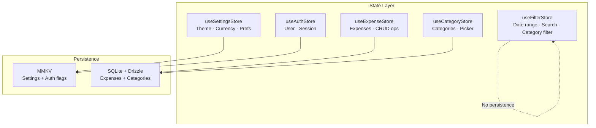

# State Management — Zustand (MVP) + TanStack Query (Phase 2)

**Last updated:** 2026-02-11  
**MVP:** Zustand for all client/UI state  
**Phase 2+:** Add TanStack Query for server/API state

---

## 1) State Architecture



---

## 2) Store Design Rules

1. **One store per domain** — don't cram everything into a single store.
2. **Zustand selectors** — always select specific fields, never the entire store.
3. **Persistence** — only persist what's needed (settings → MMKV, data → SQLite).
4. **No API calls in stores** — stores call use-cases, use-cases call repositories.
5. **Immutable updates** — Zustand's `set()` does shallow merge by default.

---

## 3) Store Implementations

### 3.1 Settings Store — `src/store/useSettingsStore.ts`

```typescript
// src/store/useSettingsStore.ts
import { create } from 'zustand';
import { persist, createJSONStorage } from 'zustand/middleware';
import { mmkvStateStorage } from './middleware/mmkvPersist';

type ThemeMode = 'light' | 'dark' | 'system';

interface SettingsState {
  themeMode: ThemeMode;
  currencyCode: string;
  hasOnboarded: boolean;
  lastUsedCategoryId: string | null;
}

interface SettingsActions {
  setThemeMode: (mode: ThemeMode) => void;
  setCurrencyCode: (code: string) => void;
  setHasOnboarded: (val: boolean) => void;
  setLastUsedCategoryId: (id: string) => void;
  resetSettings: () => void;
}

const initialState: SettingsState = {
  themeMode: 'system',
  currencyCode: 'USD',
  hasOnboarded: false,
  lastUsedCategoryId: null,
};

export const useSettingsStore = create<SettingsState & SettingsActions>()(
  persist(
    (set) => ({
      ...initialState,

      setThemeMode: (mode) => set({ themeMode: mode }),
      setCurrencyCode: (code) => set({ currencyCode: code }),
      setHasOnboarded: (val) => set({ hasOnboarded: val }),
      setLastUsedCategoryId: (id) => set({ lastUsedCategoryId: id }),
      resetSettings: () => set(initialState),
    }),
    {
      name: 'settings-storage',
      storage: createJSONStorage(() => mmkvStateStorage),
    },
  ),
);
```

### 3.2 Auth Store — `src/store/useAuthStore.ts`

```typescript
// src/store/useAuthStore.ts
import { create } from 'zustand';
import { persist, createJSONStorage } from 'zustand/middleware';
import { mmkvStateStorage } from './middleware/mmkvPersist';

interface AuthUser {
  uid: string;
  email: string | null;
  displayName: string | null;
  photoURL: string | null;
}

interface AuthState {
  user: AuthUser | null;
  isAuthenticated: boolean;
  isLoading: boolean;
}

interface AuthActions {
  setUser: (user: AuthUser | null) => void;
  setLoading: (loading: boolean) => void;
  signOut: () => void;
}

export const useAuthStore = create<AuthState & AuthActions>()(
  persist(
    (set) => ({
      user: null,
      isAuthenticated: false,
      isLoading: true,

      setUser: (user) => set({
        user,
        isAuthenticated: !!user,
        isLoading: false,
      }),

      setLoading: (isLoading) => set({ isLoading }),

      signOut: () => set({
        user: null,
        isAuthenticated: false,
        isLoading: false,
      }),
    }),
    {
      name: 'auth-storage',
      storage: createJSONStorage(() => mmkvStateStorage),
      partialize: (state) => ({
        user: state.user,
        isAuthenticated: state.isAuthenticated,
      }),
    },
  ),
);
```

### 3.3 Expense Store — `src/store/useExpenseStore.ts`

```typescript
// src/store/useExpenseStore.ts
import { create } from 'zustand';
import { expensesRepo, type ExpenseWithCategory, type MonthlySummary, type CategoryBreakdown } from '@/repositories/expenses.repo';

interface ExpenseState {
  // Recent expenses list (Home screen)
  recentExpenses: ExpenseWithCategory[];
  isLoadingRecent: boolean;

  // Monthly summary
  monthlySummary: MonthlySummary | null;

  // Category breakdown
  categoryBreakdown: CategoryBreakdown[];

  // Operation state
  isSaving: boolean;
  error: string | null;
}

interface ExpenseActions {
  // Data fetching
  fetchRecentExpenses: (limit?: number) => Promise<void>;
  fetchMonthlySummary: (year: number, month: number) => Promise<void>;
  fetchCategoryBreakdown: (year: number, month: number) => Promise<void>;

  // CRUD operations
  addExpense: (data: Parameters<typeof expensesRepo.create>[0]) => Promise<void>;
  updateExpense: (id: string, data: Parameters<typeof expensesRepo.update>[1]) => Promise<void>;
  deleteExpense: (id: string) => Promise<string>; // returns id for undo
  undoDelete: (id: string) => Promise<void>;

  // State management
  clearError: () => void;
  refreshAll: () => Promise<void>;
}

export const useExpenseStore = create<ExpenseState & ExpenseActions>()((set, get) => ({
  recentExpenses: [],
  isLoadingRecent: false,
  monthlySummary: null,
  categoryBreakdown: [],
  isSaving: false,
  error: null,

  fetchRecentExpenses: async (limit = 20) => {
    set({ isLoadingRecent: true });
    try {
      const now = new Date();
      const startOfMonth = new Date(now.getFullYear(), now.getMonth(), 1);
      const results = await expensesRepo.listByDateRange(startOfMonth, now);
      set({ recentExpenses: results.slice(0, limit), isLoadingRecent: false });
    } catch (err) {
      set({ error: (err as Error).message, isLoadingRecent: false });
    }
  },

  fetchMonthlySummary: async (year, month) => {
    try {
      const summary = await expensesRepo.getMonthlySummary(year, month);
      set({ monthlySummary: summary });
    } catch (err) {
      set({ error: (err as Error).message });
    }
  },

  fetchCategoryBreakdown: async (year, month) => {
    try {
      const breakdown = await expensesRepo.getCategoryBreakdown(year, month);
      set({ categoryBreakdown: breakdown });
    } catch (err) {
      set({ error: (err as Error).message });
    }
  },

  addExpense: async (data) => {
    set({ isSaving: true, error: null });
    try {
      await expensesRepo.create(data);
      await get().refreshAll();
      set({ isSaving: false });
    } catch (err) {
      set({ error: (err as Error).message, isSaving: false });
    }
  },

  updateExpense: async (id, data) => {
    set({ isSaving: true, error: null });
    try {
      await expensesRepo.update(id, data);
      await get().refreshAll();
      set({ isSaving: false });
    } catch (err) {
      set({ error: (err as Error).message, isSaving: false });
    }
  },

  deleteExpense: async (id) => {
    try {
      await expensesRepo.softDelete(id);
      await get().refreshAll();
      return id;
    } catch (err) {
      set({ error: (err as Error).message });
      throw err;
    }
  },

  undoDelete: async (id) => {
    try {
      await expensesRepo.restore(id);
      await get().refreshAll();
    } catch (err) {
      set({ error: (err as Error).message });
    }
  },

  clearError: () => set({ error: null }),

  refreshAll: async () => {
    const now = new Date();
    await Promise.all([
      get().fetchRecentExpenses(),
      get().fetchMonthlySummary(now.getFullYear(), now.getMonth() + 1),
      get().fetchCategoryBreakdown(now.getFullYear(), now.getMonth() + 1),
    ]);
  },
}));
```

### 3.4 Filter Store — `src/store/useFilterStore.ts`

```typescript
// src/store/useFilterStore.ts
import { create } from 'zustand';

interface FilterState {
  // Date range
  startDate: Date;
  endDate: Date;

  // Category filter
  selectedCategoryId: string | null;

  // Search
  searchQuery: string;

  // Sort
  sortBy: 'date' | 'amount';
  sortOrder: 'asc' | 'desc';
}

interface FilterActions {
  setDateRange: (start: Date, end: Date) => void;
  setSelectedCategory: (id: string | null) => void;
  setSearchQuery: (query: string) => void;
  setSortBy: (sort: 'date' | 'amount') => void;
  toggleSortOrder: () => void;
  resetFilters: () => void;
}

const getInitialState = (): FilterState => {
  const now = new Date();
  return {
    startDate: new Date(now.getFullYear(), now.getMonth(), 1),
    endDate: now,
    selectedCategoryId: null,
    searchQuery: '',
    sortBy: 'date',
    sortOrder: 'desc',
  };
};

export const useFilterStore = create<FilterState & FilterActions>()((set) => ({
  ...getInitialState(),

  setDateRange: (startDate, endDate) => set({ startDate, endDate }),
  setSelectedCategory: (selectedCategoryId) => set({ selectedCategoryId }),
  setSearchQuery: (searchQuery) => set({ searchQuery }),
  setSortBy: (sortBy) => set({ sortBy }),
  toggleSortOrder: () => set((s) => ({ sortOrder: s.sortOrder === 'asc' ? 'desc' : 'asc' })),
  resetFilters: () => set(getInitialState()),
}));
```

### 3.5 Category Store — `src/store/useCategoryStore.ts`

```typescript
// src/store/useCategoryStore.ts
import { create } from 'zustand';
import { db } from '@/db/client';
import { categories, type Category, type NewCategory } from '@/db/schema';
import { eq, isNull, asc } from 'drizzle-orm';
import { v4 as uuid } from 'uuid';

interface CategoryState {
  categories: Category[];
  isLoading: boolean;
  error: string | null;
}

interface CategoryActions {
  fetchCategories: () => Promise<void>;
  addCategory: (data: Pick<NewCategory, 'name' | 'icon' | 'colorToken'>) => Promise<void>;
  updateCategory: (id: string, data: Partial<NewCategory>) => Promise<void>;
  archiveCategory: (id: string) => Promise<void>;
  getActiveCategories: () => Category[];
}

export const useCategoryStore = create<CategoryState & CategoryActions>()((set, get) => ({
  categories: [],
  isLoading: false,
  error: null,

  fetchCategories: async () => {
    set({ isLoading: true });
    try {
      const results = await db
        .select()
        .from(categories)
        .where(isNull(categories.deletedAt))
        .orderBy(asc(categories.sortOrder));
      set({ categories: results, isLoading: false });
    } catch (err) {
      set({ error: (err as Error).message, isLoading: false });
    }
  },

  addCategory: async (data) => {
    const now = new Date();
    await db.insert(categories).values({
      id: uuid(),
      ...data,
      sortOrder: get().categories.length + 1,
      isArchived: false,
      createdAt: now,
      updatedAt: now,
    });
    await get().fetchCategories();
  },

  updateCategory: async (id, data) => {
    await db.update(categories)
      .set({ ...data, updatedAt: new Date() })
      .where(eq(categories.id, id));
    await get().fetchCategories();
  },

  archiveCategory: async (id) => {
    await db.update(categories)
      .set({ isArchived: true, updatedAt: new Date() })
      .where(eq(categories.id, id));
    await get().fetchCategories();
  },

  getActiveCategories: () =>
    get().categories.filter((c) => !c.isArchived),
}));
```

---

## 4) MMKV Persist Middleware — `src/store/middleware/mmkvPersist.ts`

```typescript
// src/store/middleware/mmkvPersist.ts
import { StateStorage } from 'zustand/middleware';
import { MMKV } from 'react-native-mmkv';

const storage = new MMKV({ id: 'zustand-persist' });

export const mmkvStateStorage: StateStorage = {
  getItem: (name: string): string | null => {
    const value = storage.getString(name);
    return value ?? null;
  },
  setItem: (name: string, value: string): void => {
    storage.set(name, value);
  },
  removeItem: (name: string): void => {
    storage.delete(name);
  },
};
```

---

## 5) Selector Patterns (Performance)

### ✅ Correct — Select specific fields

```typescript
// Only re-renders when monthlySummary changes
const summary = useExpenseStore((s) => s.monthlySummary);
const isLoading = useExpenseStore((s) => s.isLoadingRecent);
```

### ❌ Wrong — Select entire store

```typescript
// Re-renders on ANY store change — never do this
const store = useExpenseStore();
```

### Multiple Selectors (Use shallow compare)

```typescript
import { useShallow } from 'zustand/react/shallow';

const { recentExpenses, isLoadingRecent, error } = useExpenseStore(
  useShallow((s) => ({
    recentExpenses: s.recentExpenses,
    isLoadingRecent: s.isLoadingRecent,
    error: s.error,
  })),
);
```

---

## 6) TanStack Query Integration (Phase 2+)

When adding cloud sync, wrap API calls with TanStack Query:

```typescript
// src/hooks/useExpensesQuery.ts (Phase 2)
import { useQuery, useMutation, useQueryClient } from '@tanstack/react-query';
import { expensesApi } from '@/services/api/expenses';

export const QUERY_KEYS = {
  expenses: ['expenses'] as const,
  expenseDetail: (id: string) => ['expenses', id] as const,
  monthlySummary: (year: number, month: number) => ['expenses', 'summary', year, month] as const,
};

export function useExpensesQuery(startDate: Date, endDate: Date) {
  return useQuery({
    queryKey: [...QUERY_KEYS.expenses, startDate, endDate],
    queryFn: () => expensesApi.list(startDate, endDate),
    staleTime: 1000 * 60 * 5, // 5 minutes
  });
}

export function useCreateExpenseMutation() {
  const queryClient = useQueryClient();
  return useMutation({
    mutationFn: expensesApi.create,
    onSuccess: () => {
      queryClient.invalidateQueries({ queryKey: QUERY_KEYS.expenses });
    },
  });
}
```

---

## 7) Store Barrel Export — `src/store/index.ts`

```typescript
// src/store/index.ts
export { useSettingsStore } from './useSettingsStore';
export { useAuthStore } from './useAuthStore';
export { useExpenseStore } from './useExpenseStore';
export { useCategoryStore } from './useCategoryStore';
export { useFilterStore } from './useFilterStore';
```
