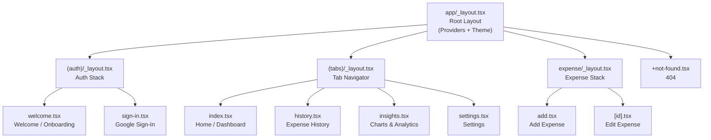

# Navigation & Routes — Expo Router Screen Map + Layouts

**Last updated:** 2026-02-11  
**Router:** Expo Router (file-based routing built on React Navigation)

---

## 1) Screen Map Overview



---

## 2) Route Table

| Route Path | File | Screen | Auth Required | Tab |
|---|---|---|---|---|
| `/` | `app/index.tsx` | Redirect → `/welcome` or `/(tabs)` | No | — |
| `/welcome` | `app/(auth)/welcome.tsx` | Onboarding / Welcome | No | — |
| `/sign-in` | `app/(auth)/sign-in.tsx` | Google Sign-In | No | — |
| `/(tabs)` | `app/(tabs)/index.tsx` | Home Dashboard | Yes | 🏠 Home |
| `/(tabs)/history` | `app/(tabs)/history.tsx` | Expense History + Filters | Yes | 📋 History |
| `/(tabs)/insights` | `app/(tabs)/insights.tsx` | Charts & Analytics | Yes | 📊 Insights |
| `/(tabs)/settings` | `app/(tabs)/settings.tsx` | Settings | Yes | ⚙️ Settings |
| `/expense/add` | `app/expense/add.tsx` | Add Expense (Modal) | Yes | — |
| `/expense/[id]` | `app/expense/[id].tsx` | Edit Expense (Modal) | Yes | — |

---

## 3) Layout Implementations

### 3.1 Root Layout — `app/_layout.tsx`

```typescript
// app/_layout.tsx
import { useEffect } from 'react';
import { useColorScheme } from 'react-native';
import { Slot, useRouter, useSegments } from 'expo-router';
import { TamaguiProvider, Theme } from 'tamagui';
import { useFonts } from 'expo-font';
import * as SplashScreen from 'expo-splash-screen';
import { StatusBar } from 'expo-status-bar';

import config from '../tamagui.config';
import { useAuthStore, useSettingsStore } from '@/store';
import { runMigrations } from '@/db/client';
import { seedDefaultCategories } from '@/db/seed';

// Keep splash screen visible while loading
SplashScreen.preventAutoHideAsync();

export default function RootLayout() {
  const systemScheme = useColorScheme();
  const themeMode = useSettingsStore((s) => s.themeMode);
  const isAuthenticated = useAuthStore((s) => s.isAuthenticated);
  const isAuthLoading = useAuthStore((s) => s.isLoading);

  const segments = useSegments();
  const router = useRouter();

  const resolvedTheme = themeMode === 'system'
    ? (systemScheme ?? 'light')
    : themeMode;

  const [fontsLoaded] = useFonts({
    Inter: require('../assets/fonts/Inter-Regular.ttf'),
    InterMedium: require('../assets/fonts/Inter-Medium.ttf'),
    InterSemiBold: require('../assets/fonts/Inter-SemiBold.ttf'),
    InterBold: require('../assets/fonts/Inter-Bold.ttf'),
  });

  // Initialize database on app start
  useEffect(() => {
    async function init() {
      await runMigrations();
      await seedDefaultCategories();
    }
    init();
  }, []);

  // Auth-based routing guard
  useEffect(() => {
    if (isAuthLoading) return;

    const inAuthGroup = segments[0] === '(auth)';

    if (!isAuthenticated && !inAuthGroup) {
      router.replace('/welcome');
    } else if (isAuthenticated && inAuthGroup) {
      router.replace('/(tabs)');
    }
  }, [isAuthenticated, isAuthLoading, segments]);

  // Hide splash when ready
  useEffect(() => {
    if (fontsLoaded && !isAuthLoading) {
      SplashScreen.hideAsync();
    }
  }, [fontsLoaded, isAuthLoading]);

  if (!fontsLoaded || isAuthLoading) return null;

  return (
    <TamaguiProvider config={config}>
      <Theme name={resolvedTheme}>
        <StatusBar style={resolvedTheme === 'dark' ? 'light' : 'dark'} />
        <Slot />
      </Theme>
    </TamaguiProvider>
  );
}
```

### 3.2 Auth Layout — `app/(auth)/_layout.tsx`

```typescript
// app/(auth)/_layout.tsx
import { Stack } from 'expo-router';

export default function AuthLayout() {
  return (
    <Stack
      screenOptions={{
        headerShown: false,
        animation: 'fade',
      }}
    />
  );
}
```

### 3.3 Tab Layout — `app/(tabs)/_layout.tsx`

```typescript
// app/(tabs)/_layout.tsx
import { Tabs } from 'expo-router';
import { useTheme } from 'tamagui';
import { Ionicons } from '@expo/vector-icons';

export default function TabLayout() {
  const theme = useTheme();

  return (
    <Tabs
      screenOptions={{
        headerShown: false,
        tabBarActiveTintColor: theme.tabBarActive.val,
        tabBarInactiveTintColor: theme.tabBarInactive.val,
        tabBarStyle: {
          backgroundColor: theme.tabBarBackground.val,
          borderTopColor: theme.tabBarBorder.val,
          borderTopWidth: 1,
          paddingTop: 4,
          height: 60,
        },
        tabBarLabelStyle: {
          fontSize: 11,
          fontFamily: 'Inter',
          fontWeight: '500',
          marginBottom: 4,
        },
      }}
    >
      <Tabs.Screen
        name="index"
        options={{
          title: 'Home',
          tabBarIcon: ({ color, size }) => (
            <Ionicons name="home-outline" size={size} color={color} />
          ),
        }}
      />
      <Tabs.Screen
        name="history"
        options={{
          title: 'History',
          tabBarIcon: ({ color, size }) => (
            <Ionicons name="list-outline" size={size} color={color} />
          ),
        }}
      />
      <Tabs.Screen
        name="insights"
        options={{
          title: 'Insights',
          tabBarIcon: ({ color, size }) => (
            <Ionicons name="pie-chart-outline" size={size} color={color} />
          ),
        }}
      />
      <Tabs.Screen
        name="settings"
        options={{
          title: 'Settings',
          tabBarIcon: ({ color, size }) => (
            <Ionicons name="settings-outline" size={size} color={color} />
          ),
        }}
      />
    </Tabs>
  );
}
```

### 3.4 Expense Layout (Modal Stack) — `app/expense/_layout.tsx`

```typescript
// app/expense/_layout.tsx
import { Stack } from 'expo-router';
import { useTheme } from 'tamagui';

export default function ExpenseLayout() {
  const theme = useTheme();

  return (
    <Stack
      screenOptions={{
        presentation: 'modal',
        headerStyle: {
          backgroundColor: theme.surface.val,
        },
        headerTintColor: theme.textPrimary.val,
        headerTitleStyle: {
          fontFamily: 'InterSemiBold',
          fontSize: 17,
        },
      }}
    >
      <Stack.Screen
        name="add"
        options={{ title: 'Add Expense' }}
      />
      <Stack.Screen
        name="[id]"
        options={{ title: 'Edit Expense' }}
      />
    </Stack>
  );
}
```

---

## 4) Screen Implementations (Skeleton)

### 4.1 Home Screen — `app/(tabs)/index.tsx`

```typescript
// app/(tabs)/index.tsx
import { useEffect } from 'react';
import { useRouter } from 'expo-router';
import { YStack } from 'tamagui';
import { ScreenContainer } from '@/components/templates';
import { MonthlySummaryCard, ExpenseList, QuickAddFAB } from '@/components/organisms';
import { Text } from '@/components/atoms';
import { useExpenseStore } from '@/store';

export default function HomeScreen() {
  const router = useRouter();
  const { recentExpenses, monthlySummary, isLoadingRecent, refreshAll } = useExpenseStore();

  useEffect(() => {
    refreshAll();
  }, []);

  return (
    <ScreenContainer scrollable>
      <YStack gap="$lg" paddingVertical="$lg">
        <Text variant="h3">Dashboard</Text>

        <MonthlySummaryCard
          totalSpent={monthlySummary?.totalMinor ?? 0}
          currency="USD"
          transactionCount={monthlySummary?.count ?? 0}
        />

        <Text variant="h4">Recent Expenses</Text>

        <ExpenseList
          expenses={recentExpenses}
          isLoading={isLoadingRecent}
          onPress={(id) => router.push(`/expense/${id}`)}
          emptyMessage="No expenses yet. Tap + to add one!"
        />
      </YStack>

      <QuickAddFAB onPress={() => router.push('/expense/add')} />
    </ScreenContainer>
  );
}
```

### 4.2 Redirect — `app/index.tsx`

```typescript
// app/index.tsx
import { Redirect } from 'expo-router';
import { useAuthStore, useSettingsStore } from '@/store';

export default function Index() {
  const isAuthenticated = useAuthStore((s) => s.isAuthenticated);
  const hasOnboarded = useSettingsStore((s) => s.hasOnboarded);

  if (!hasOnboarded) return <Redirect href="/welcome" />;
  if (!isAuthenticated) return <Redirect href="/sign-in" />;
  return <Redirect href="/(tabs)" />;
}
```

---

## 5) Navigation Utilities — `src/hooks/useAuth.ts`

```typescript
// src/hooks/useAuth.ts
import { useRouter } from 'expo-router';
import { useAuthStore, useSettingsStore } from '@/store';
import { signInWithGoogle, signOut as firebaseSignOut } from '@/services/firebase/auth';

export function useAuth() {
  const router = useRouter();
  const { setUser, signOut: clearAuthStore } = useAuthStore();
  const { setHasOnboarded } = useSettingsStore();

  const signIn = async () => {
    try {
      const user = await signInWithGoogle();
      setUser({
        uid: user.uid,
        email: user.email,
        displayName: user.displayName,
        photoURL: user.photoURL,
      });
      setHasOnboarded(true);
      router.replace('/(tabs)');
    } catch (error) {
      console.error('[Auth] Sign-in failed:', error);
      throw error;
    }
  };

  const signOut = async () => {
    try {
      await firebaseSignOut();
      clearAuthStore();
      router.replace('/welcome');
    } catch (error) {
      console.error('[Auth] Sign-out failed:', error);
    }
  };

  return { signIn, signOut };
}
```

---

## 6) Deep Linking Configuration

```json
// app.json (partial)
{
  "expo": {
    "scheme": "expense-tracker",
    "web": {
      "bundler": "metro"
    },
    "plugins": ["expo-router"]
  }
}
```

| Deep Link | Route |
|---|---|
| `expense-tracker://` | Home |
| `expense-tracker:///expense/add` | Add Expense |
| `expense-tracker:///history` | History |
| `expense-tracker:///settings` | Settings |

---

## 7) Navigation Rules

1. **Auth guard in root layout** — never duplicate auth checks in screens
2. **Modal for expense add/edit** — feels native, preserves tab context
3. **No nested navigators** — keep it flat (auth group, tabs group, expense stack)
4. **Type-safe routes** — use Expo Router's typed routes when available
5. **Screen params via route** — `useLocalSearchParams()` for dynamic routes
