# Development Workflow — Commands, EAS Builds & CI/CD Pipeline

**Last updated:** 2026-02-17  
**Build system:** Expo + EAS Build | **CI:** GitHub Actions (recommended)

---

## 1) Daily Development Commands

### 1.1 Start Development Server

```bash
# Start Expo dev server
npx expo start

# Start with cache cleared
npx expo start --clear

# Start for specific platform
npx expo start --ios
npx expo start --android
```

### 1.2 Code Quality

```bash
# TypeScript type checking
npx tsc --noEmit

# Lint
npx eslint . --ext .ts,.tsx

# Format
npx prettier --write "src/**/*.{ts,tsx}"

# All quality checks (add to package.json scripts)
npm run typecheck && npm run lint && npm run format
```

### 1.3 Database

```bash
# Generate migration after schema change
npx drizzle-kit generate

# View generated SQL
npx drizzle-kit up

# Push schema directly (dev only)
npx drizzle-kit push

# Open Drizzle Studio (DB browser)
npx drizzle-kit studio
```

### 1.4 Testing

```bash
# Run all tests
npm test

# Run tests in watch mode
npm test -- --watch

# Run specific test file
npm test -- --testPathPattern="Button.test"

# Run with coverage
npm test -- --coverage
```

---

## 2) Recommended package.json Scripts

```json
{
  "scripts": {
    "start": "expo start",
    "android": "expo start --android",
    "ios": "expo start --ios",
    "web": "expo start --web",

    "typecheck": "tsc --noEmit",
    "lint": "eslint . --ext .ts,.tsx --max-warnings 0",
    "lint:fix": "eslint . --ext .ts,.tsx --fix",
    "format": "prettier --write \"src/**/*.{ts,tsx,json}\"",
    "format:check": "prettier --check \"src/**/*.{ts,tsx,json}\"",

    "test": "jest",
    "test:watch": "jest --watch",
    "test:coverage": "jest --coverage",

    "db:generate": "drizzle-kit generate",
    "db:push": "drizzle-kit push",
    "db:studio": "drizzle-kit studio",

    "build:dev": "eas build --profile development",
    "build:preview": "eas build --profile preview",
    "build:prod": "eas build --profile production",
    "submit": "eas submit --profile production",

    "quality": "npm run typecheck && npm run lint && npm run test",
    "precommit": "npm run typecheck && npm run lint && npm run format:check"
  }
}
```

---

## 3) EAS Build Profiles

### 3.1 Development Build (Internal testing)

```bash
# Build development client
eas build --profile development --platform android
eas build --profile development --platform ios

# Or both platforms
eas build --profile development --platform all
```

### 3.2 Preview Build (Staging / QA)

```bash
eas build --profile preview --platform all
```

### 3.3 Production Build (App Store / Play Store)

```bash
# Build
eas build --profile production --platform all

# Submit to stores
eas submit --profile production --platform android
eas submit --profile production --platform ios
```

---

## 4) CI/CD Pipeline — GitHub Actions

### 4.1 Pull Request Checks — `.github/workflows/pr-check.yml`

```yaml
name: PR Quality Checks

on:
  pull_request:
    branches: [main, develop]

jobs:
  quality:
    runs-on: ubuntu-latest
    steps:
      - uses: actions/checkout@v4

      - name: Setup Node.js
        uses: actions/setup-node@v4
        with:
          node-version: '20'
          cache: 'npm'

      - name: Install dependencies
        run: npm ci

      - name: TypeScript check
        run: npx tsc --noEmit

      - name: Lint
        run: npx eslint . --ext .ts,.tsx --max-warnings 0

      - name: Format check
        run: npx prettier --check "src/**/*.{ts,tsx}"

      - name: Unit tests
        run: npm test -- --coverage --ci

      - name: Security audit
        run: npm audit --production --audit-level=high
```

### 4.2 Build on Merge — `.github/workflows/build.yml`

```yaml
name: Build & Deploy

on:
  push:
    branches: [main]

jobs:
  build:
    runs-on: ubuntu-latest
    steps:
      - uses: actions/checkout@v4

      - name: Setup Node.js
        uses: actions/setup-node@v4
        with:
          node-version: '20'
          cache: 'npm'

      - name: Setup Expo
        uses: expo/expo-github-action@v8
        with:
          eas-version: latest
          token: ${{ secrets.EXPO_TOKEN }}

      - name: Install dependencies
        run: npm ci

      - name: Quality checks
        run: npm run quality

      - name: Build preview
        run: eas build --profile preview --platform all --non-interactive
```

---

## 5) Git Workflow

### 5.1 Branching Strategy

```text
main          ← Production releases (protected)
  └── develop ← Integration branch
       ├── feature/add-expense-form
       ├── feature/category-picker
       ├── fix/amount-rounding-bug
       └── chore/update-dependencies
```

### 5.2 Commit Convention (Conventional Commits)

```text
feat: add expense creation form
fix: correct amount rounding for JPY
chore: update Tamagui to 1.x
docs: add component architecture guide
test: add unit tests for summary calculations
refactor: extract expense validator
style: fix lint warnings in theme
```

### 5.3 PR Checklist

```markdown
## PR Checklist
- [ ] TypeScript compiles (`npx tsc --noEmit`)
- [ ] Linting passes (`npm run lint`)
- [ ] Tests pass (`npm test`)
- [ ] No new `any` types introduced
- [ ] No hardcoded colors or magic numbers
- [ ] Components follow atomic structure
- [ ] Screen states handled (loading, empty, error)
```

---

## 6) Environment Management

### 6.1 Environment Files

```text
.env.example          ← Template (committed)
.env.local            ← Local dev (gitignored)
.env.staging          ← Staging config (gitignored)
.env.production       ← Production config (gitignored)
```

### 6.2 Accessing Variables

```typescript
// Expo automatically loads EXPO_PUBLIC_ prefixed vars
const apiKey = process.env.EXPO_PUBLIC_FIREBASE_API_KEY;
```

### 6.3 Feature Flags (Public env)

```text
# Toggle Firebase auth UI + guards
EXPO_PUBLIC_AUTH_ENABLED=false
```

```json
// eas.json (per-profile env overrides for dev/preview)
{
  "build": {
    "development": {
      "env": {
        "EXPO_PUBLIC_AUTH_ENABLED": "false"
      }
    }
  }
}
```

### 6.4 EAS Secrets (Production)

```bash
# Set secrets for EAS builds
eas secret:create --name FIREBASE_API_KEY --value "your-key"
eas secret:create --name FIREBASE_PROJECT_ID --value "your-project"

# List secrets
eas secret:list
```

---

## 7) Release Checklist

### Before every release:

```markdown
## Release Checklist v{X.Y.Z}

### Code Quality
- [ ] All TypeScript errors resolved
- [ ] Lint: 0 warnings
- [ ] Unit test coverage ≥ 70%
- [ ] Integration tests pass on fresh DB

### Functionality
- [ ] Sign-in/sign-out works
- [ ] Add/edit/delete expense works
- [ ] Category CRUD works
- [ ] Monthly summary accurate
- [ ] Filters work correctly
- [ ] CSV export produces correct file
- [ ] Theme toggle stable (light ↔ dark)
- [ ] Empty states display correctly

### Performance
- [ ] Cold start < 2.5s on mid-range device
- [ ] List scrolling smooth (60fps)
- [ ] No memory leaks in dev tools

### Security
- [ ] No secrets in code
- [ ] Tokens in secure storage
- [ ] npm audit clean (no high/critical)

### Release
- [ ] Version bumped in app.json
- [ ] Changelog updated
- [ ] EAS build successful
- [ ] Tested on physical device (Android + iOS)
- [ ] Crash reporting verified
```

---

## 8) Project Build Order (MVP Phases)

```mermaid
gantt
  title Expense Tracker MVP Build Timeline
  dateFormat  X
  axisFormat %s

  section Phase 0 — Setup
  Project Init + Dependencies     :a1, 0, 1
  Theme + Design System           :a2, 1, 2
  Navigation + Layouts            :a3, 2, 3
  SQLite + Drizzle Schema         :a4, 3, 4

  section Phase 1 — Core
  Category CRUD + Seed            :b1, 4, 6
  Expense Form + CRUD             :b2, 6, 9
  Home Screen + Summary           :b3, 9, 11
  History + Filters               :b4, 11, 13
  Insights + Charts               :b5, 13, 15

  section Phase 1.5 — Polish
  Auth (Firebase Google)          :c1, 15, 17
  CSV Export                      :c2, 17, 18
  Error Handling + Empty States   :c3, 18, 19
  Testing + QA                    :c4, 19, 21
```


